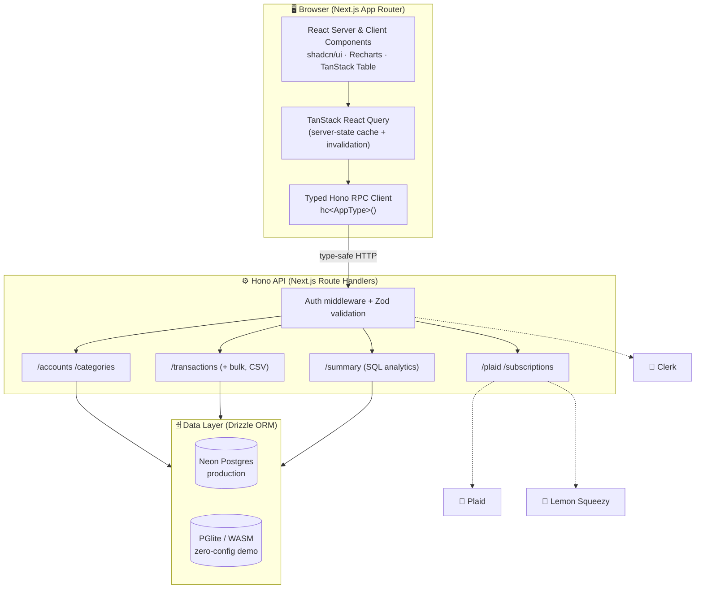
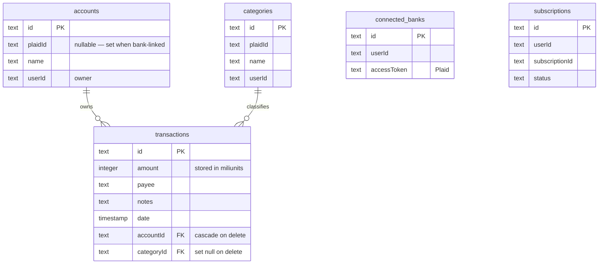

<div align="center">

# 💸 Finlytics

### A production-grade personal-finance & analytics platform

Track income and spending, connect real bank accounts, import statements, and turn raw transactions into clear, period-over-period insight — all in a fast, fully type-safe Next.js application.

<br/>


</div>

---

## 📋 Table of Contents

- [Overview](#-overview)
- [Try It in 30 Seconds](#-try-it-in-30-seconds)
- [Feature Tour](#-feature-tour)
- [System Architecture](#-system-architecture)
- [Data Model](#-data-model)
- [Tech Stack](#-tech-stack)
- [Engineering Highlights](#-engineering-highlights)
- [API Reference](#-api-reference)
- [Getting Started](#-getting-started)
- [Environment Variables](#-environment-variables)
- [Project Structure](#-project-structure)
- [Available Scripts](#-available-scripts)

---

## 🔎 Overview

**Finlytics** is a complete, full-stack money-management dashboard. It gives a single household or a small business one place to record every dollar in and out, categorize it, connect live bank feeds, and understand *where the money actually goes* through an interactive analytics layer.

It is not a toy CRUD app. Under the hood it ships a **type-safe RPC API**, **server-side financial aggregation in SQL**, **integer-based money math** (no floating-point rounding bugs), **real third-party integrations** for banking and billing, and a **zero-configuration demo mode** that boots an entire Postgres database *inside the Node process* so anyone can run it with a single command — no accounts, no cloud services, no setup.

> **In one sentence:** Finlytics turns a stream of raw transactions into an executive-grade financial dashboard, backed by an architecture that is fast, fully typed end-to-end, and production-ready.

---

## ⚡ Try It in 30 Seconds

No database. No API keys. No signup.

```bash
git clone https://github.com/suleman-the-stammer/finlytics.git
cd finlytics
npm install
npm run dev
```

Open **http://localhost:3000** — the app auto-provisions an **embedded WASM Postgres**, creates the schema, and seeds a realistic set of accounts, categories, and transactions. You land straight on a fully populated dashboard.

Point it at a real database later by simply setting `DATABASE_URL` — **no code changes required.**

---

## 🧭 Feature Tour

### 📊 Executive Analytics Dashboard
The home screen answers the three questions everyone asks about their money — *How much came in? How much went out? What's left?* — and puts them in context.

- **Three headline KPIs** — **Remaining (net)**, **Income**, and **Expenses**, each rendered with smooth **animated count-up** figures.
- **Period-over-period intelligence** — every KPI is automatically compared against the *immediately preceding equal-length window* and annotated with a **percentage change** (e.g. "expenses +12% vs. the previous 30 days"). Selecting a 7-day range compares to the prior 7 days; a quarter compares to the prior quarter — dynamically.
- **Transactions-over-time chart** with switchable **Area / Line / Bar** visualizations. Days with no activity are intelligently **back-filled to zero**, so the timeline is always continuous and never misleading.
- **Spending-by-category breakdown** as a **Pie / Radar / Radial** chart. The **top 3 categories** are surfaced explicitly and everything else is rolled into a clean **"Other"** slice.
- **Global filters** — an interactive **date-range picker** and a **per-account selector** flow through to *every* widget at once. Filter state lives in the **URL**, so any view is shareable and survives a refresh or the back button.

### 💳 Transaction Management
- **Full CRUD** with fast, slide-over **sheet** forms for create and edit.
- **Bulk operations** — multi-select rows and **bulk-delete** in one action.
- **Sortable, paginated data grid** powered by TanStack Table.
- Rich transaction model: **payee, amount, date, account, category, and free-form notes**.
- **Create categories inline** while entering a transaction — no context switching.

### 📥 CSV Import Engine
Bring in history from any bank or spreadsheet.

- Drag-and-drop **CSV upload** with client-side parsing.
- An **interactive column-mapping** step lets you match *your* file's headers (`payee`, `amount`, `date`, …) to Finlytics fields — no rigid template required.
- Mapped rows are **bulk-inserted** against the account you choose, in a single operation.

### 🏦 Accounts & Categories
- **CRUD + bulk delete** for both accounts and categories.
- Managed through the same polished sheet UI, with changes **instantly reflected** across the dashboard via cache invalidation.

### 🔗 Live Bank Connections (Plaid)
- Connect real financial institutions through **Plaid Link**.
- Secure **link-token creation → public-token exchange → access-token storage** handshake.
- **Disconnect** flow to revoke access at any time.
- Gated as a **premium** capability (see billing, below).

### 💎 Subscriptions & Paywall (Lemon Squeezy)
- **Checkout** and recurring billing via **Lemon Squeezy**.
- A reusable **paywall hook** gates premium features (such as bank sync) behind an active plan.
- An **upgrade modal** nudges free users at exactly the right moment; subscription **status is tracked in the database**.

### 🔐 Authentication & Data Isolation
- **Clerk**-powered sign-in / sign-up with session middleware protecting every route.
- **Strict per-user scoping** — every table carries a `userId`, and *every* query filters by the authenticated user. One user can never see another's data.
- **Zod validation on every endpoint**, with schemas derived directly from the database definition.

### 🚀 Zero-Config Demo Mode
- Boots an **embedded Postgres (PGlite / WebAssembly)** *inside* the Node runtime — no Docker, no cloud DB, no install.
- **Auto-creates the schema and seeds demo data** on startup.
- Ships an **offline auth stub** so the UI is fully usable without a Clerk account.
- **Deploys to Vercel with one click** and runs on cold starts — ideal for demos and portfolio review.
- **Graceful upgrade path:** provide a real `DATABASE_URL` and the app transparently switches to hosted Neon Postgres.

### 🎨 Polished, Accessible UX
- **Light & dark themes** (`next-themes`).
- **Animated metrics**, **loading skeletons**, and **optimistic toast** notifications.
- **Confirmation dialogs** guard every destructive action.
- Built on **Radix UI** primitives (via shadcn/ui) — keyboard-navigable and accessible by default, fully responsive on every screen size.

---

## 🏗 System Architecture

Finlytics is a single Next.js deployment that cleanly separates the React front end, a type-safe API layer, and a swappable data layer.



**How a request flows:** a component calls a React Query hook → the hook calls the **fully typed Hono client** → the request hits a Hono route that **authenticates, validates with Zod, and queries Postgres through Drizzle** → the response type is *inferred back to the client automatically*. The database is chosen at runtime: hosted **Neon** when configured, embedded **PGlite** otherwise.

---

## 🗃 Data Model

Five focused tables, fully relational, with cascade rules that keep data consistent.



Deleting an account **cascades** to its transactions; deleting a category **nulls** the reference so history is preserved. Money is stored as an **integer count of miliunits** rather than a float — see below.

---

## 🧰 Tech Stack

| Layer | Technologies |
| --- | --- |
| **Framework** | Next.js 14 (App Router, Server Components), React 18, TypeScript |
| **API** | Hono (edge-ready), `@hono/zod-validator`, type-safe RPC client (`hono/client`) |
| **Database & ORM** | PostgreSQL, Drizzle ORM, Drizzle Kit (migrations/studio), Neon serverless, PGlite (embedded WASM) |
| **Validation** | Zod, `drizzle-zod` (schema-derived validators) |
| **Data & State** | TanStack React Query, TanStack React Table, Zustand |
| **Auth** | Clerk (`@clerk/nextjs`, `@hono/clerk-auth`) |
| **Integrations** | Plaid + `react-plaid-link` (banking), Lemon Squeezy (billing) |
| **UI & Charts** | Tailwind CSS, shadcn/ui, Radix UI, Recharts, Lucide icons, `next-themes` |
| **Forms & Utilities** | React Hook Form, `react-papaparse` (CSV), `react-countup`, `date-fns`, `sonner`, CUID2 |

---

## 🧠 Engineering Highlights

These are the decisions that make Finlytics *feel* effortless and stay correct at scale.

- **End-to-end type safety, zero codegen.** The Hono server exports its route type, and the client is instantiated as `hc<AppType>()`. Request shapes, params, and response bodies are **inferred straight from the server** — rename a field on the backend and the frontend fails to compile. No hand-written API types, no OpenAPI step.

- **Money as integers ("miliunits").** Every amount is stored as `value × 1000` in an integer column and converted only at the UI edge. This **eliminates the floating-point rounding errors** that plague naive `float` money handling (`0.1 + 0.2 !== 0.3`), while preserving sub-cent precision.

- **Analytics computed in the database.** The `/summary` endpoint pushes aggregation into SQL — conditional `SUM(CASE …)` for income vs. expenses, `GROUP BY` for category breakdowns, and a **second query against the previous period** for growth math. The client renders results; it never crunches thousands of rows in the browser.

- **Continuous, honest time series.** A `fillMissingDays` pass injects zero-value points for inactive days, so charts can't visually imply data that isn't there.

- **Runtime-swappable persistence.** One `db` export transparently resolves to **Neon** (production) or **PGlite** (demo) based on the environment — the entire application code is database-agnostic.

- **URL as the source of truth for view state.** Date range and account filters live in query params, making every dashboard view **shareable, bookmarkable, and back-button friendly**.

- **Single source of schema truth.** Drizzle table definitions generate both the SQL migrations *and*, via `drizzle-zod`, the runtime validation schemas — one definition, guaranteed to stay in sync.

---

## 📡 API Reference

All routes are served by Hono under `/api` and are authenticated + Zod-validated.

| Resource | Endpoints |
| --- | --- |
| **Summary** | `GET /api/summary` — KPIs, period comparison, category & daily breakdowns (accepts `from`, `to`, `accountId`) |
| **Accounts** | `GET /` · `GET /:id` · `POST /` · `POST /bulk-delete` · `PATCH /:id` · `DELETE /:id` |
| **Categories** | `GET /` · `GET /:id` · `POST /` · `POST /bulk-delete` · `PATCH /:id` · `DELETE /:id` |
| **Transactions** | `GET /` (filtered) · `GET /:id` · `POST /` · `POST /bulk-create` · `POST /bulk-delete` · `PATCH /:id` · `DELETE /:id` |
| **Plaid** | `POST /create-link-token` · `POST /exchange-public-token` · `GET /connected-bank` · `DELETE /connected-bank` |
| **Subscriptions** | `GET /subscriptions/current` · `POST /subscriptions/checkout` |

---

## 🚦 Getting Started

### Prerequisites
- **Node.js 18+**
- **npm** (or `bun` — a `bun.lockb` is included)

### 1. Demo mode (recommended first run)

```bash
npm install
npm run dev
```

That's it. With no `.env`, Finlytics runs on an **embedded, auto-seeded Postgres** and an **offline auth stub**. Visit **http://localhost:3000**.

### 2. Production mode (real services)

1. Copy the example env file and fill in your keys:
   ```bash
   cp .env.example .env.local
   ```
2. Set at minimum a real `DATABASE_URL` (Neon) and your Clerk keys.
3. Apply the schema and (optionally) seed:
   ```bash
   npm run db:migrate
   npm run db:seed
   ```
4. Start the app:
   ```bash
   npm run dev
   ```

---

## 🔐 Environment Variables

Everything below is **optional for the demo** and enabled per-feature for production.

| Variable | Purpose |
| --- | --- |
| `DATABASE_URL` | Neon Postgres connection string. **Unset → embedded demo DB.** |
| `NEXT_PUBLIC_APP_URL` | Base URL used by the typed API client (e.g. `http://localhost:3000`). |
| `NEXT_PUBLIC_CLERK_PUBLISHABLE_KEY` / `CLERK_PUBLISHABLE_KEY` | Clerk public keys. |
| `CLERK_SECRET_KEY` | Clerk server key. |
| `NEXT_PUBLIC_CLERK_SIGN_IN_URL` / `NEXT_PUBLIC_CLERK_SIGN_UP_URL` | Auth route paths. |
| `PLAID_CLIENT_TOKEN` / `PLAID_SECRET_TOKEN` | Plaid banking credentials. |
| `LEMONSQUEEZY_API_KEY` / `LEMONSQUEEZY_STORE_ID` / `LEMONSQUEEZY_PRODUCT_ID` / `LEMONSQUEEZY_WEBHOOK_SECRET` | Lemon Squeezy billing. |

---

## 📂 Project Structure

```
finlytics/
├── app/
│   ├── (auth)/                # Clerk sign-in / sign-up routes
│   ├── (dashboard)/           # Dashboard, transactions, accounts, categories, settings
│   └── api/[[...route]]/      # Hono API (accounts, categories, transactions, summary, plaid, subscriptions)
├── components/                # Charts, data grid, filters, and the shadcn/ui kit
├── features/                  # Domain modules — each with its own api/ hooks, components, and stores
│   ├── accounts/  categories/  transactions/
│   ├── plaid/     subscriptions/  summary/
├── db/                        # Drizzle schema, connection, and the embedded demo database
├── lib/                       # Typed API client, money/date utilities, auth helpers
├── drizzle/                   # Generated SQL migrations & snapshots
├── providers/                 # React Query & sheet providers
└── scripts/                   # migrate & seed scripts
```

Each **feature module** is self-contained — its API hooks, UI, and local state live together — which keeps the codebase easy to navigate and extend.

---

## 📜 Available Scripts

| Script | Description |
| --- | --- |
| `npm run dev` | Start the development server (demo DB if `DATABASE_URL` is unset). |
| `npm run build` | Production build. |
| `npm run start` | Run the production build. |
| `npm run lint` | Lint with ESLint / `eslint-config-next`. |
| `npm run db:generate` | Generate SQL migrations from the Drizzle schema. |
| `npm run db:migrate` | Apply migrations to the configured database. |
| `npm run db:seed` | Seed sample data. |
| `npm run db:studio` | Open Drizzle Studio to browse data. |

---

<div align="center">

**Built with Next.js, Hono, and Drizzle — engineered for correctness, speed, and type-safety end to end.**

</div>
